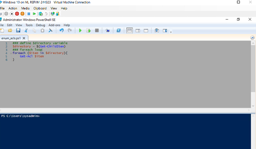

Week 7 Homework: A Day in the Life of a Windows Sysadmin

Submission Guidelines

Provide the following:

Deliverable for Task 1: Take a screenshot of all the GPOs created for this homework assignment. To find these, launch the Group Policy Management tool, select Group Policy Objects, and take a screenshot of the GPOs you've created.

Since this part of the assignment was not up to subjective interpretation, I’m just going to provide the screenshots I was asked for without editorializing. But I had the worst time doing this assignment. -The virtual machines all kept rebooting randomly and it became difficult to read the screen through all my very-real, non-exaggerated tears of frustration.

 

 

In a later screenshot is a tidier shot of the GPOs that I link to GC Computers.

Deliverable for Task 2: Submit a screenshot of the different Account Lockout policies in Group Policy Management Editor. It should show the three values you set under the Policy and Policy Setting columns.

I cut down on the 10/15/15 guideline. The documentation states that the suggestion for lockout was 10 bad attempts with 15-minute lockout duration after which, the 15-minute lockout clock would reset. Previously, they suggested 5 bad attempts with the same lockout duration and countdown but went to 10 after seeing issues with valid users having login issues. I settled on 7 bad attempts with the same 15-minute lockout timer. I found that to be a middle ground between 5 bad attempts overwhelming administrators and limiting opportunity for attackers. However, it’s not best practice to rely solely on the effectiveness of system lockout. There should be framework to implemented within multi-factor authentication (when available) and/or require complex passwords as a means to mitigate the policy.

  

Deliverable for Task 3: Submit a screenshot of the different Windows PowerShell policies within the Group Policy Management Editor. Four of these should be enabled.

 

 

 

 

 

 

Deliverable for Task 4: Submit a copy of your enum_acls.ps1 script.

I will also submit the script. But for the sake of convenience, here’s what it contains:

### define $directory variable
$directory = $(Get-ChildItem)
### foreach loop
foreach ($item in $directory){
    Get-Acl $item
}

Deliverable for Bonus Task 5: Submit a screenshot of the contents of one of your transcribed PowerShell logs or a copy of one of the logs.

Logs will be attached.
