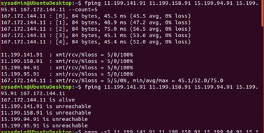
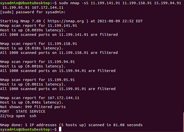
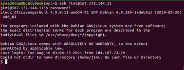
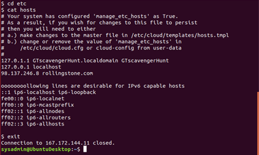
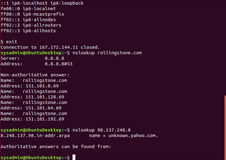
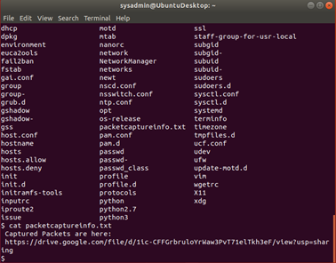
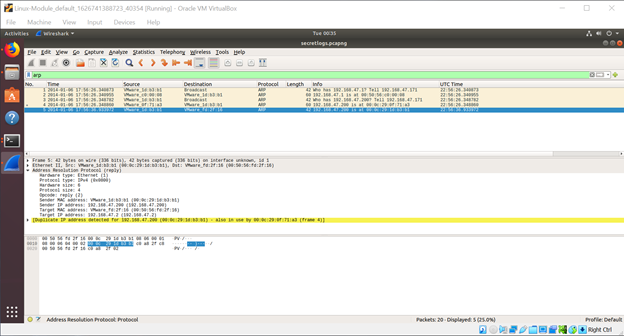
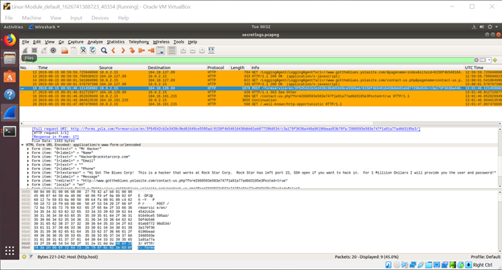

Rockstar Hollywood Office Server Ping Analysis:

Ping Analysis:

I determined from the provided spreadsheet that the IPs for the Hollywood office were: 11.199.141.91 11.199.158.91 15.199.94.91 15.199.95.91 167.172.144.11.

Command Used:
fping 11.199.141.91 11.199.158.91 15.199.94.91 15.199.95.91 167.172.144.11 --count=5

Terminal Output:
sysadmin@UbuntuDesktop:~$ fping 11.199.141.91 11.199.158.91 15.199.94.91 15.199.95.91 167.172.144.11 --count=5
167.172.144.11 : [0], 84 bytes, 45.5 ms (45.5 avg, 0% loss)
167.172.144.11 : [1], 84 bytes, 48.9 ms (47.2 avg, 0% loss)
167.172.144.11 : [2], 84 bytes, 75.0 ms (56.5 avg, 0% loss)
167.172.144.11 : [3], 84 bytes, 45.1 ms (53.6 avg, 0% loss)
167.172.144.11 : [4], 84 bytes, 45.4 ms (52.0 avg, 0% loss)

11.199.141.91  : xmt/rcv/%loss = 5/0/100%
11.199.158.91  : xmt/rcv/%loss = 5/0/100%
15.199.94.91   : xmt/rcv/%loss = 5/0/100%
15.199.95.91   : xmt/rcv/%loss = 5/0/100%
167.172.144.11 : xmt/rcv/%loss = 5/5/0%, min/avg/max = 45.1/52.0/75.0

As seen below, simply typing: fping 11.199.141.91 11.199.158.91 15.199.94.91 15.199.95.91 167.172.144.11 only returned its own conclusion for whether an IP was alive and no further information. So, it seemed more prudent to add a ping count to illustrate what was actually taking place.

sysadmin@UbuntuDesktop:~$ fping 11.199.141.91 11.199.158.91 15.199.94.91 15.199.95.91 167.172.144.11
167.172.144.11 is alive
11.199.141.91 is unreachable
11.199.158.91 is unreachable
15.199.94.91 is unreachable
15.199.95.91 is unreachable

Ping Summary:
Results indicate that one IP, 167.172.144.11 is currently responding to pings. 11.199.141.91 11.199.158.91, 15.199.94.91, and 15.199.95.91 did not respond to pings. ICMP pings are considered OSI layer 3, the network layer. Whereas something like SNMP pings would be layer 7.

SYN Scan Analysis:

I decided to test all of the IPs for the Hollywood office because I thought it would provide good contrast and be more interesting than it actually was. Another reason: I consider myself a child at heart and children have a poor concept of time, are curious to a fault, and (most importantly) need to be explicitly told not to do something. By the time I began to consider the demand of testing all those ports for each IP, I was already too committed to abort the scan. However, I did have an interesting time watching what was going on in Wireshark. I’ll just add that file into the assignment so it doesn't go to waste.

Command Used:
sudo nmap -sS 11.199.141.91 11.199.158.91 15.199.94.91 15.199.95.91 167.172.144.11

Terminal Output:
sysadmin@UbuntuDesktop:~$ sudo nmap -sS 11.199.141.91 11.199.158.91 15.199.94.91 15.199.95.91 167.172.144.11
[sudo] password for sysadmin:

Starting Nmap 7.60 ( https://nmap.org ) at 2021-08-09 20:12 EDT
Warning: 167.172.144.11 giving up on port because retransmission cap hit (10).
Nmap scan report for 11.199.141.91
Host is up (0.067s latency).
All 1000 scanned ports on 11.199.141.91 are filtered

Nmap scan report for 11.199.158.91
Host is up (0.0074s latency).
All 1000 scanned ports on 11.199.158.91 are filtered

Nmap scan report for 15.199.94.91
Host is up (0.015s latency).
All 1000 scanned ports on 15.199.94.91 are filtered

Nmap scan report for 15.199.95.91
Host is up (0.00025s latency).
All 1000 scanned ports on 15.199.95.91 are filtered

Nmap scan report for 167.172.144.11
Host is up (0.084s latency).
Not shown: 999 closed ports
PORT   STATE SERVICE
22/tcp open  ssh

Nmap done: 5 IP addresses (5 hosts up) scanned in 8488.20 seconds

SYN Scan Summary:
Of all the ports that were scanned, only 167.172.144.11:22 was open. Port 22 is the common port for SSH, Secure Shell. SSH is a layer 7 / application protocol that offers an encrypted communication link, typically providing a remote command line. However, the SYN scan itself, is run on the transport / layer 4 of the OSI model.

Open Port and DNS Cache Analysis:

Commands Used:
There were more than a few commands being used to complete this portion of the report. Below are screenshots that capture all the steps taken and their corresponding commands. I went to the /etc/hosts file due to the context clues provided. However, it’s possible to just run: grep -r “rollingstone*” . -That will show all files (including hidden) that contain that phrase.

Starting SSH Session with Provided Credentials:

Locating the Source of the Redirection Issue:

Looking Up the DNS Information for rollingstone.com and the spoofed IP:

Summary:
The above shows a DNS poisoning attack; where the local machine’s cache of previously resolved DNS queries has been modified to point towards a presumed attacker’s IP address. Attempts to visit the valid IP for rollingstone.com (151.101.192.69) will be redirected to 98.137.248.8. Attacks like these occur at the transport layer (4th).

Packet Analysis:

Visible below, listing the contents of the /etc directory where the hosts file was stored. The file containing the packet capture information is plainly labeled. From there, Wireshark was utilized to analyze the packets captured. So, the only command that was used was simply ls.

  

 

Regarding ARP, this MAC ending in B3:B1 makes two simple ARP requests that are responded to by 2 different devices. But on the 5th packet, it can be seen responding to its own request, claiming to have the requested IP. The highlighted “Duplicate IP address detected” message towards the bottom indicates the suspicious behavior. With 5 packets, it’s difficult to discern whether it’s trying to misdirect traffic intended for a singular targeted IP or if it would continue to attribute other IP addresses to its singular MAC. This is by its essence a layer 2 / Data attack.

  

Here is a screenshot of their HTTP activity. Someone navigates to the “contact us” page for a website: gottheblues.yolasite.com. They then authored a note explaining that port 22 is open and are willing to provide credentials for the price of $1 million. Which is adorable in its simplicity. I don’t know how well a corporate espionage cold call over an official channel will work, but that’s certainly one way to do it. By the way, all of this is happening in the application layer.

I also don’t understand why the ARP attack and the HTTP shenanigans would be related. They don’t even seem to be originating from the same device. Or even at the same time. They seem random in that regard.

Mitigating Solutions:

Primary suggestions for mitigation include disabling unnecessary ICMP traffic at the firewall, regular scans of network devices, regularly clearing cache, applying appropriate patches (possibly antivirus software), segmenting, and monitoring the network for any rogue devices.

ICMP can be a troubleshooting tool for administrators, but there are risks associated with replying to requests outside of your own network. Appropriate firewall rules will disallow replies to requests for unauthorized parties.

The act of network scanning isn’t something that can be prevented, but visibility on your network can be limited. Building a network infrastructure that is more difficult to navigate by external parties will decrease the likelihood of being targeted. That may be one of the more challenging tasks with an increased variety of plug and play offerings.

As front-facing assets, servers should be regularly patched and monitored to prevent falling prey to exploits and attacks. Patches are just an integral part of keeping production systems in production. Rogue devices will bring down any network, but monitoring can shorten and quarter off the impact to a network. Segmentation of the network will only further diminish any impact to an organization. Clearing caches and the possible implementation of antivirus can also help administrators stay on top of particularly vulnerable equipment. 

Networks make messes easily even on the best of days. Their documentation, upkeep, and protection not only limit the possibility for chaos, but can also reward administrators with less overall troubleshooting time. And speaking from a little bit of experience, it gets exponentially more frustrating to restore any service the longer a network goes without proper attention or tidying.
