Unit 9 Networking Fundamentals II Submission File

Part 1: My answer would be less open-ended if there was an actual error message to indicate where the issue is occurring. In the context of MX records, being able to send but not receive emails can commonly occur when MX records recently changed and haven't had time to update (depending on TTL configuration), entry of the information isn't in the correct format for the specific host, or the DNS/MX records entries themselves are otherwise input incorrectly (ex. Typo). Below are the results of nslookup MX records for starwars.com.

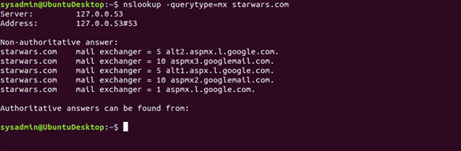

I assume that since this is a real-world domain with MX Records that match the prescribed settings for Google Workspace, they don't actually have a DNS-related mail server issue. If I suspend my disbelief enough, I'm guessing that I'm supposed to point out that there are no entries for asltx.l.google.com or asltx.2.google.com. The records may require updating. Basically, when you can send emails but not receive them it means that for whatever reason, your mail server isn't being pointed to correctly. So, servers trying to send email don't know where to go or are going to the wrong place. To make the MX records with a primary server at asltx.l.google.com and a secondary of asltx.2.google.com you would want to go to your host's DNS settings and add the correct DNS information for the mail server that is being used, so in this case asltx.l.google.com and asltx.2.google. Then, if you'd like them prioritized you'd set your primary with the highest priority, 1 and any subsequent secondary servers will have appropriately higher numbers. In the above example, we see one primary, two secondaries set to priority 5, and 2 more set to priority 10.

Part 2: The issue here is that users are not receiving emails from theforce.net after the bulletin changed their mail server's IP address to 45.23.176.21\. We were then asked to manually check the Sender Policy Framework (SPF) with nslookup. Here are the results:

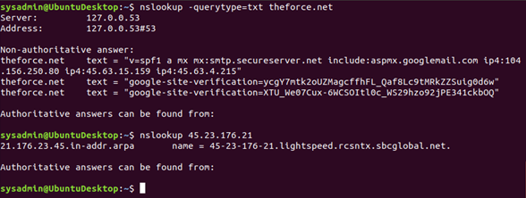

The returned SPF information, specifically "v=spf1 a mx mx:smtp.secureserver.net include:aspmx.googlemail.com ip4:104.156.250.80 ip4:45.63.15.159 ip4:45.63.4.215" indicates the addresses that domain has cleared for sending email. 45.23.176.21 isn't recognized as a valid sender address, so recipients will most likely find any email sent from theforce.net from that public IP address in their spam (if it wasn't immediately rejected or discarded). As things are configured now, sending emails from a theforce.net address from 45.63.4.215 would look like the message has been sent in bad faith since the domain hasn't whitelisted that address. If theforce.net wanted to send emails from 45.23.176.21, they would need to explicitly include it in the SPF record. And the way to go about that will vary slightly depending on the host they are using.

Part 3: Here we are asked to look at the CNAME entries for www.theforce.net through nslookup. We're looking to see if resistance.theforce.net is set to redirect to theforce.net. Below is the query:

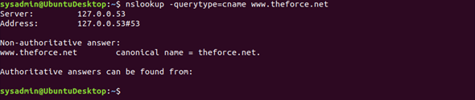

This search queried the CNAME entry for www.theforce.net which redirects to the canonical name theforce.net. This isn't uncommon. Many entities will establish alias domain names to another domain. To get resistance.theforce.net to redirect to theforce.net we would want to see a similar entry if we ran a CNAME query for resistance.theforce.net that has theforce.net listed as its canonical name. Presuming that they have both domains, they would want to configure this CNAME record through their host of choice.

Part 4: Here we want to add a secondary DNS server for princessleia.site to eliminate some single point of failure issues that occurred in the past. Here is the current configuration:

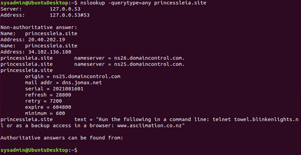

Now, we would want to add ns2.galaxybackup.com as one of the nameservers similar to how ns26.domaincontrol.com and ns25.domaincontrol.com currently reside. This will also be done through settings on the hosting solution as well.

Part 5: I made a reproduction of the network diagram on a graphing website that helps find the shortest path. The site uses Dijkstra's algorithm to find the shortest path which is the algorithm used with OSPF. Aside from double-checking my math, recreating the map helps me pay attention to the entire thing. Which was actually helpful in pointing out that there is no defined distance for P to Q. But that didn't seem to affect anything since it seems in the end it's too expensive to go through P. Even if you make the cost of the hop from P to Q 0, it doesn't make sense to use that hop. Results are below:

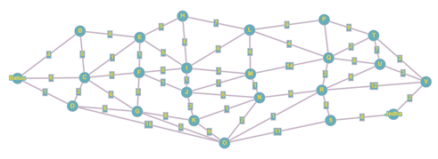

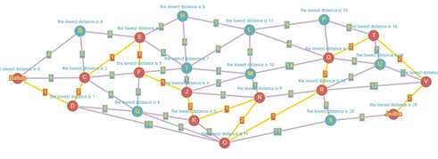

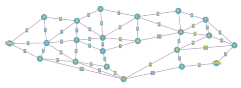

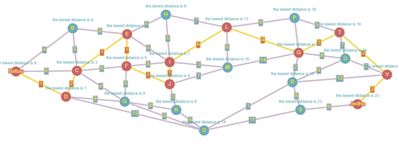

I ran the algorithm twice. Once with N and its paths intact and a second with N removed as a valid hop. So normally, with N as a valid hop, the shortest path adds up to 20\. It runs as follows:

- Batuu⇒D⇒C⇒E⇒F⇒J⇒K⇒N⇒O⇒R⇒Q⇒T⇒V⇒Jedha

Without N, the path adds up to 23 and runs:

- Batuu⇒D⇒C⇒E⇒F⇒J⇒I⇒L⇒Q⇒T⇒V⇒Jedha

I will attach a copy of my map that should be able to be loaded into the graph site: <https://graphonline.ru/en/>

Part 6: Let's dive into the fun stuff. First, I open up the capture to ensure that a 4-way handshake has occurred since we're looking to crack a network utilizing WPA.

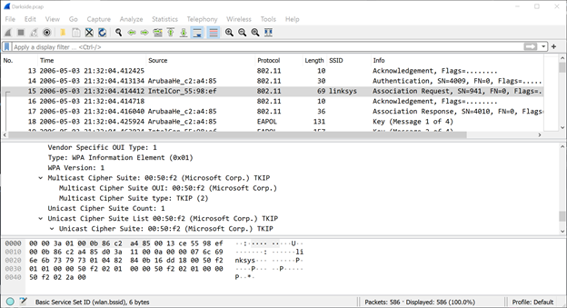 Above, you will see the client device that has connected did so using WPA(1)-PSK authentication and the cipher type is TKIP. So, gaining unauthorized access isn't a herculean task.

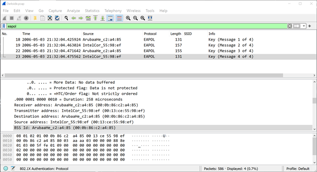 Here is the EAPOL filter applied to ensure that we have a 4-way handshake.

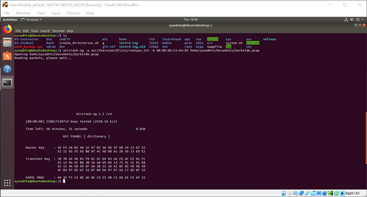 Here is me telling Aircrack-ng to do all of the busy work.

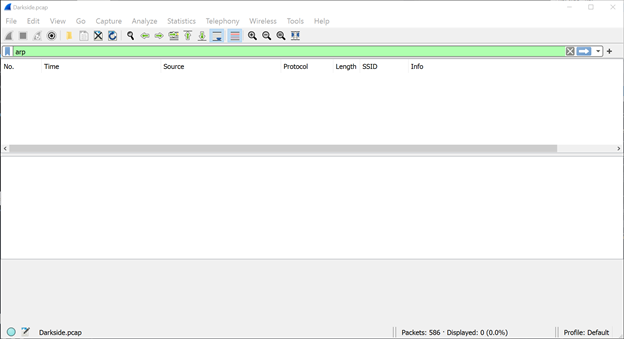 Here is a filter for ARP before enabling decryption.

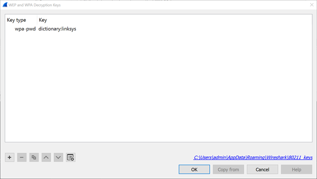 Here, I input the decryption information. Edit>Preferences>Protocols>802.11>Enable Decryption.

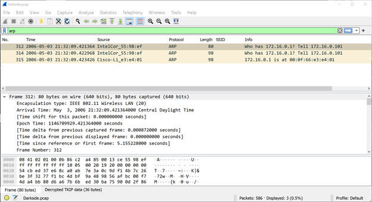 Here is an ARP filter after decryption.

The two devices that were captured using ARP were:

00-13-CE-55-98-EF @ 172.16.0.101 00-0F-66-E3-E4-01 @ 172.16.0.1

Part 7:

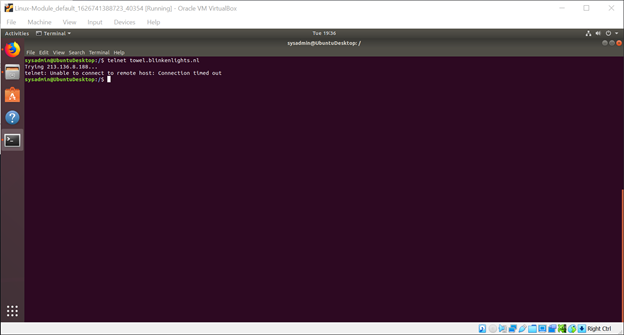 Telnet wasn't my friend.

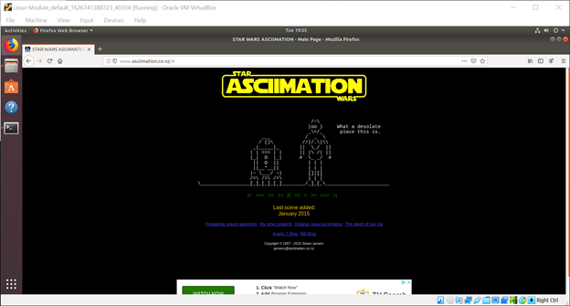 Purely coincidental screencap.
