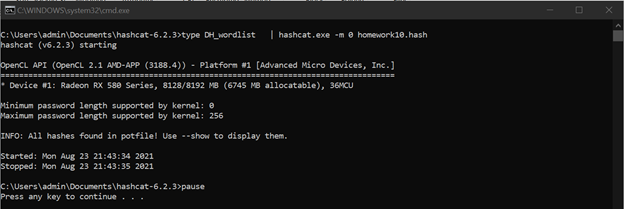
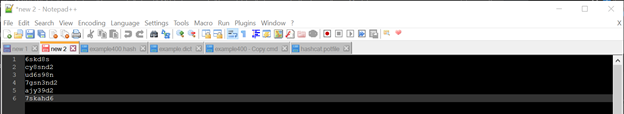

Unit 10 Homework Submission File:

Riddle 1:

This riddle hits you with the subtlety hammer to indicate this is a Caesar cipher with a displacement of 8\. Knowing that the displacement is 8, the encoded text "ozcjmz" can be deciphered to be gruber. The code below was recovered entering that password into the answer box for riddle 1:

Code: 6skd8s

Riddle 2:

I got the second code by entering "01000111 01100101 01101110 01101110 01100101 01110010 01101111" into a binary to ascii converter. The password was Gennero.

Code: cy8snd2

Riddle 3:

I got the third code by using OpenSSL and the options that were provided to us along with the riddle in my virtual machine. I had a tough time getting it to work because I was originally working with the offline version of the homework which was missing the last 2 characters of the cipher text. When I got it all to work, the password was takagi. The command I used was: sysadmin@UbuntuDesktop:~$ sudo openssl enc -pbkdf2 -nosalt -aes-256-cbc -d -in homework_10.txt -base64 -K 5284A3B154D99487D9D8D8508461A478C7BEB67081A64AD9A15147906E8E8564 -iv 1907C5E255F7FC9A6B47B0E789847AED

homework_10.txt was a file that I made to house the cipher text of: 4qMOIvwEGXzvkMvRE2bNbg==

Code: ud6s98n

Riddle 4:

4a: Jill's Public Key. Jack would send a message intended for Jill to decrypt (presumably with her private key) using her public key. Here's my thought process' metaphor: Jill has a pair of glasses that allow her to see a certain color of ink (her private key). She gives her friends each a pen that writes in this color (her public key). If Jack wanted to send her a secret message, he'd use the pen she gave him.

4b. Jill's private key. I think I did pretty well explaining how I got this far with my metaphor. Jill's using her glasses.

4c. 12 Asymmetric and 15 Symmetric keys. Asymmetric keys for X users = 2X. Symmetric keys for X users = X(X-1)/2\. For 6 users that would mean 12 Asymmetric and 15 Symmetric keys.

4d. Alice's Public Key. By process of elimination, it could only have been Alice's public key. The only other options were Tim's Public Key or other people's private keys.

Code: 7gsn3nd2

Riddle 5:

Clearly, we are supposed to crack this MD5 hash. At first, I tried hashcat on the school Ubuntu VM. I kept getting various errors related to what appeared to be hardware issues. I ended up using CrackStation just to make sure that I finished the assignment. The password ended up being argyle. Then, I went back and went through getting hashcat to work. I was troubleshooting, so I tried various different things. I wanted to rule out the possibility that it was that specific instance of Ubuntu having trouble accessing the hardware by trying with a different VM. My Kali VM with a more recent version of hashcat also gave me hardware issues. I had the best luck using it natively on Windows. It appears that there was an issue with virtualization. For the sake of the exercise, I made a small Die Hard wordlist and used that with hashcat.

Code: ajy39d2

Riddle 6: This task was a lot simpler than the previous riddle. All we had to do was extract an encoded message from an image file. The password was ABC according to the rhyme that was included along with the riddle. Once I input that, the file with the code was extracted.

Code: 7skahd6

Decrypter:

I just put all of the codes that I gathered into the places where the form told me to.

