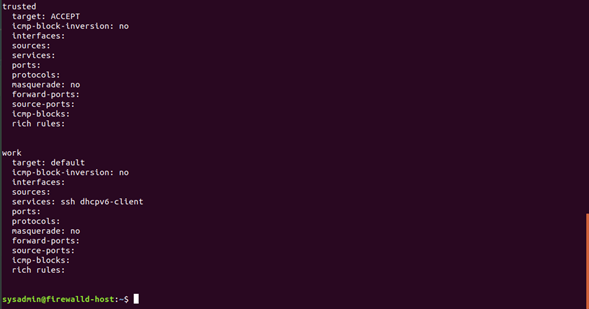
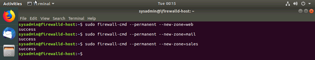
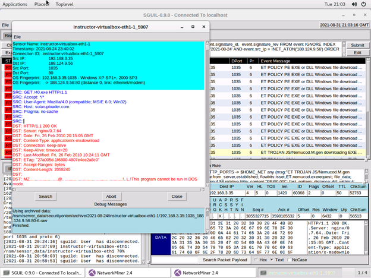

Unit 11 Submission File: Network Security Homework

Part 1: Review Questions

Security Control Types

The concept of defense in depth can be broken down into three different security control types. Identify the security control type of each set of defense tactics.

1. Walls, bollards, fences, guard dogs, cameras, and lighting are what type of security control?

Answer: These types of controls are categorized as physical security controls. Anything that renders unauthorized access to a physical location or resource prohibitively taxing would be categorized as a physical control.

2. Security awareness programs, BYOD policies, and ethical hiring practices are what type of security control?

Answer: These are administrative security controls. Their importance lies mainly in communicating the importance of security and creating procedures and policies that holistically implement security safeguarding. You could have all of the physical and technical security controls in the world, but they wouldn’t do anything to protect an organization or person holding the metaphorical front door open for intruders.

3. Encryption, biometric fingerprint readers, firewalls, endpoint security, and intrusion detection systems are what type of security control?
Answer: These are technical security controls. Some of them border into technical/physical controls but these are considered technical controls.

Intrusion Detection and Attack indicators

What's the difference between an IDS and an IPS?

Answer: An IDS is a system that will detect intrusion and notify an administrator whereas an IPS will act against what it defines as intrusion. In acting against intrusion, an IPS can be configured to take actions on its own including: dropping traffic, also alerting administrators, and/or cleaning bad traffic. They also differ in placement. An IDS doesn’t need to be inline on a network since it doesn’t need to interrupt traffic, but an IPS needs to be inline, or it can’t really function. The biggest consequence is that an IPS can cause latency issues processing all the traffic. Even if it’s all legitimate.

What's the difference between an Indicator of Attack and an Indicator of Compromise?

Answer: IoC is a term that describes evidence of things that have occurred as part of a historical breach. By their very nature, they are limited to describing specific things that have already happened. Their value is only good if they can reflect the current cybersecurity landscape. Since they’re comparatively more specific, they tend to diminish in value relatively quickly. In contrast, IoA can describe an attack’s methodology in more broad strokes. They can describe the framework of an attack that may have changed in terms of Indicators of Compromise but has the same general structure. They require less advanced knowledge to successfully protect systems. It’s the awareness that a crowbar and a battering ram both have similar effects on doors. But the consequence of painting in broad strokes will be false alarms. But if the biggest problem is false alarms, less days are probably getting ruined.

The Cyber Kill Chain

Name each of the seven stages for the Cyber Kill chain and provide a brief example of each.

Most typically, when people are talking about the Cyber Kill Chain, they are talking about the model released in a Lockheed Martin paper. It’s a model for identifying intrusion and preventing it based on an attacker’s objectives.

Stage 1: Reconnaissance. This will include intercepted data, communications, and other pieces of information that characterize the landscape. This could be something like finding employee’s personal information online, looking at a company’s email domain structure to deduce possible employee email addresses for spearphishing.
Stage 2: Weaponization. This will be the combination of leveraging an exploit with a backdoor. That could be deciding on using an exploit like EternalBlue with a backdoor implant tool. Backdoor implant tools will have some capabilities that mainly focus on establishing connectivity and executing commands.
Stage 3: Delivery. This is the action of taking the weapon and introducing it to the system. This can be an email attachment, a USB, or any other means of entering a system.
Stage 4: Exploitation. This is the use of a vulnerability to perform actions on a victim system. This is where an intruder prepares to attack. They use the exploit to prepare and facilitate installing the tools they will be using.
Stage 5: Installation. This is the installation of malware onto victim systems. Here, a multitude of things could be installed. Most typically, malware will be installed. This could be malware that uses C&C protocols. In a metaphor, this is where the robber throws their bag of tools over the fence.
Stage 6: Command and Control. This is opening the channel of communication for remote control of a victim system. The target system will phone home to the C&C server to receive further instruction.
Stage 7: Actions on Objectives. This is the completion of the attacker’s initial goal. They will achieve whatever goal requiring unauthorized access to the target system.

I started using literal examples of exploits and malware, then I sort of stopped because I felt like I was getting too far away from the intention of the question. But basically the idea is: A potential intruder would first use various means of information gathering to facilitate their attack, and formulate both the delivery and types of tools the task requires. For example, an attacker could obtain the name of an employee in the billing/accounting department and the general format for email addresses on the domain. Taking that information, they could infer the email address of specific employees who would be likely to open an email attachment. In this case, maybe they disguise the attachment as an invoice. Then the attachment will be formulated to contain tools that are intended to exploit vulnerabilities to a target system. This will usually include a tool to leverage an exploit in order to install the other tools, often the secondary tools are ones capable of creating a backdoor, gathering information about other systems on the network, and propagating to other parts of the network. Then, once this level of access and control has been achieved, the intruder can move on to whatever tasks required this attack to facilitate.

Snort Rule Analysis

Use the Snort rule to answer the following questions:

Snort Rule #1:
alert tcp $EXTERNAL_NET any -> $HOME_NET 5800:5820 (msg:"ET SCAN Potential VNC Scan 5800-5820"; flags:S,12; threshold: type both, track by_src, count 5, seconds 60; reference:url,doc.emergingthreats.net/2002910; classtype:attempted-recon; sid:2002910; rev:5; metadata:created_at 2010_07_30, updated_at 2010_07_30;)

Break down the Sort Rule header and explain what is happening.

Answer: This rule is looking for signs network port scanning. Basically, if any inbound traffic from an external IP starts trying to talk to this network’s TCP ports 5800-5820 over a threshold of 5 within 60 seconds, this alert will be triggered.

What stage of the Cyber Kill Chain does this alert violate?

Answer: This is looking to prevent Stage 1, Reconnaissance in the Cyber Kill Chain.

What kind of attack is indicated?

Answer: The header says that this is a Potential VNC Scan. This kind of scan can be a sign of someone running Metasploit.

Snort Rule #2:
alert tcp $EXTERNAL_NET $HTTP_PORTS -> $HOME_NET any (msg:"ET POLICY PE EXE or DLL Windows file download HTTP"; flow:established,to_client; flowbits:isnotset,ET.http.binary; flowbits:isnotset,ET.INFO.WindowsUpdate; file_data; content:"MZ"; within:2; byte_jump:4,58,relative,little; content:"PE|00 00|"; distance:-64; within:4; flowbits:set,ET.http.binary; metadata: former_category POLICY; reference:url,doc.emergingthreats.net/bin/view/Main/2018959; classtype:policy-violation; sid:2018959; rev:4; metadata:created_at 2014_08_19, updated_at 2017_02_01;)

Break down the Sort Rule header and explain what is happening.

Answer: This is a rule set to alert should there be any inbound traffic from an external IP over the known HTTP ports to the internal network. Which I think just means TCP traffic coming in over port 80.

What layer of the Defense in Depth model does this alert violate?

Answer: I have been arguing with myself for a couple of days over what this question is asking. I’m trying to determine what form of the DiD model I’m supposed to be providing. I wasn’t sure if this was asking for one of the three security controls covered earlier (Physical, Technical, Administrative) or if it was asking me to pick from Perimeter, Network, Host, Application, or Data. I’m inclined to think it’s the latter. Without knowing much about the specific network topology, I would have to say this is a Perimeter or Network Layer alert. It can be confusing especially because systems with Snort, Suricata, etc. have architecture for host, network, and perimeter IDS/IPS functionality.

But you can also categorize this as a policy violation. In fact, that is plastered everywhere in the alert. But I doubt that would constitute claiming this is a policy/administrative control. Mechanically, this is a technical control. As this alert is written, it goes off when inbound traffic from any external IP over TCP port 80 (HTTP) is observed. If perimeter layer defenses are defined as measures implemented to fortify the boundary between internal and external networks, this would be a perimeter layer defense.

What kind of attack is indicated?

Answer: It says ET Policy PE EXE or DLL. It’s trying to catch traffic on a port that is known to be used to transfer files with formats commonly associated with malicious downloads.

Snort Rule #3

Your turn! Write a Snort rule that alerts when traffic is detected inbound on port 4444 to the local network on any port. Be sure to include the msg in the Rule Option.

Answer: Since I wasn’t familiar with what was associated with TCP port 4444, I went to emerging threats to see how I should set up the rule and what the intention was. I found rule 2013235 which is an alert for a buffer overflow attempt having to do with a SCADA system which I thought was weird. So then I just searched for “tcp 4444” and found it’s a common port for some rootkit, backdoor, and trojans which I thought made more sense. So, I made the following:

alert tcp $EXTERNAL_NET 4444 -> $HOME_NET any ( msg:"ET TROJAN GENERAL Possible Trojan, Rootkit, Backdoor" )

Part 2: "Drop Zone" Lab

Log into the Azure firewalld machine

Log in using the following credentials:
Username: sysadmin
Password: cybersecurity

Uninstall ufw

Before getting started, you should verify that you do not have any instances of ufw running. This will avoid conflicts with your firewalld service. This also ensures that firewalld will be your default firewall.

Run the command that removes any running instance of ufw.

Enable and start firewalld

By default, these service should be running. If not, then run the following commands:

Run the commands that enable and start firewalld upon boots and reboots.

Note: This will ensure that firewalld remains active after each reboot.

Confirm that the service is running.

Run the command that checks whether or not the firewalld service is up and running.

List all firewall rules currently configured.

Next, lists all currently configured firewall rules. This will give you a good idea of what's currently configured and save you time in the long run by not doing double work.
Run the command that lists all currently configured firewall rules:

Take note of what Zones and settings are configured. You may need to remove unneeded services and settings.

List all supported service types that can be enabled.

Run the command that lists all currently supported services to see if the service you need is available

We can see that the Home and Drop Zones are created by default.

Zone Views

Run the command that lists all currently configured zones.

We can see that the Public and Drop Zones are created by default. Therefore, we will need to create Zones for Web, Sales, and Mail.

Create Zones for Web, Sales and Mail.

Run the commands that creates Web, Sales and Mail zones.

Set the zones to their designated interfaces:

Run the commands that sets your eth interfaces to your zones.

Add services to the active zones:

Run the commands that add services to the public zone, the web zone, the sales zone, and the mail zone.

Public:

Web:

Sales:

Mail:

What is the status of http, https, smtp and pop3?

I checked with sudo firewall-cmd –list-all-interfaces, and all of the four interfaces are active and have the correct services associated with them. It’s a long terminal output, but it looks correct to me.

Add your adversaries to the Drop Zone.

Run the command that will add all current and any future blacklisted IPs to the Drop Zone.

Make rules permanent then reload them:

It's good practice to ensure that your firewalld installation remains nailed up and retains its services across reboots. This ensure that the network remains secured after unplanned outages such as power failures.

Run the command that reloads the firewalld configurations and writes it to memory

View active Zones

Now, we'll want to provide truncated listings of all currently active zones. This a good time to verify your zone settings.

Run the command that displays all zone services.

Block an IP address

Use a rich-rule that blocks the IP address 138.138.0.3.

Block Ping/ICMP Requests

Harden your network against ping scans by blocking icmp ehco replies.

Run the command that blocks pings and icmp requests in your public zone.

*Here, I saw where this was going, and I went back and ran the ping and rich rule as permanent as well to keep the settings persistent.

Rule Check
Now that you've set up your brand new firewalld installation, it's time to verify that all of the settings have taken effect.

Run the command that lists all of the rule settings. Do one command at a time for each zone.

Are all of our rules in place? If not, then go back and make the necessary modifications before checking again.
Congratulations! You have successfully configured and deployed a fully comprehensive firewalld installation.
________________________________________

Part 3: IDS, IPS, DiD and Firewalls:

Now, we will work on another lab. Before you start, complete the following review questions.

IDS vs. IPS Systems

Name and define two ways an IDS connects to a network.
Answer 1: Traffic / Port Mirroring
Answer 2: Network Tap

Describe how an IPS connects to a network.
Answer: An IPS will typically be located behind a network’s firewall and in front of its primary switch or wherever the LAN starts getting distributed.

What type of IDS compares patterns of traffic to predefined signatures and is unable to detect Zero-Day attacks?

Answer: That would be a signature IDS.

Which type of IDS is beneficial for detecting all suspicious traffic that deviates from the well-known baseline and is excellent at detecting when an attacker probes or sweeps a network?

Answer: That would be an Anomaly IDS.

Defense in Depth

For each of the following scenarios, provide the layer of Defense in Depth that applies:

A criminal hacker tailgates an employee through an exterior door into a secured facility, explaining that they forgot their badge at home.

Answer: This is a breach of physical layer controls.

A zero-day goes undetected by antivirus software.

Answer: This would be a breach host layer defenses. That’s assuming that the anti-virus software is of the garden-variety anti-virus software aimed at protecting consumer endpoint devices.

A criminal successfully gains access to HR’s database.

Answer: This is most likely an application layer breach since the attack is being performed on a database server.

A criminal hacker exploits a vulnerability within an operating system.

Answer: Presuming this OS is on an endpoint device, this would most likely be a host layer breach.

A hacktivist organization successfully performs a DDoS attack, taking down a government website.

Answer: My guess is that the question wants me to say that this is a network layer breach. Since the perimeter layer is typically the area where you implement DMZs for resources that need to be available publicly. The perimeter is soft enough to allow these public connections while keeping those resources segmented from the internal network. So, the perimeter layer may not be focused on preventing attacks so much as creating a designated area to place more susceptible resources. From there, network firewalls and IDS/IPSs protect the internal network. So a network firewall and other resources would be responsible for dropping traffic from DDoS attack.

Data is classified at the wrong classification level.

Answer: I think that this would be a policy layer breach. Depending on if that is a part of the model. The class slides didn’t have Policies as one of the layers, the other iterations of the layers I found had it. It may fit as a data layer breach a bit better. If I can infer that the prompt means integrity, confidentiality, or availability of data wasn’t maintained, then it would be a data layer breach.

A state sponsored hacker group successfully firewalked an organization to produce a list of active services on an email server.

Answer: I think this is the perimeter-layer one. Looking at the prompts, this is the one that most closely matches a perimeter layer breach.

Name one method of protecting data-at-rest from being readable on hard drive.

Answer: The most common methods are firewalls and antivirus, however encryption is also a standard for protecting data-at-rest that is becoming nearly as common. Reasonable people encrypt phones, hard drives, other forms of media storage.

Name one method to protect data-in-transit.

Answer: End to end encryption such as what is employed through HTTPS.

What technology could provide law enforcement with the ability to track and recover a stolen laptop.

Answer: Both Microsoft and Apple have integrated location services for devices like laptops as part of their integration with unified cloud accounts. Also, depending on the email service being used, the IP address of a logged in device can be retrieved. As long as the laptop is logged in to an account tracking public IPs and locations with unfettered internet connectivity, it can be found.

How could you prevent an attacker from booting a stolen laptop using an external hard drive?

Answer: While the best thing truly is physical security to prevent the theft in the first place, firmware, BIOS, or UEFI passwords are an option for securing a device at the hardware level. Implementing a password to protect your boot options and disabling booting from USB would protect a stolen laptop from being booted with an external boot media. At least until they remove the CMOS battery.

Firewall Architectures and Methodologies

Which type of firewall verifies the three-way TCP handshake? TCP handshake checks are designed to ensure that session packets are from legitimate sources.

Answer: A circuit-level firewall works by verifying the three-way TCP handshake. However, they only inspect the header of the packet.

Which type of firewall considers the connection as a whole? Meaning, instead of looking at only individual packets, these firewalls look at whole streams of packets at one time.

Answer: A stateful packet-filtering firewall will examine a connection fully, so it can not only evaluate a TCP handshake but also inspect the contents of the packet.

Which type of firewall intercepts all traffic prior to being forwarded to its final destination. In a sense, these firewalls act on behalf of the recipient by ensuring the traffic is safe prior to forwarding it?

Answer: These are Application or Proxy firewalls. They conduct deep packet along with stateful inspection.

Which type of firewall examines data within a packet as it progresses through a network interface by examining source and destination IP address, port number, and packet type- all without opening the packet to inspect its contents?

Answer: This would be a stateless packet-filtering firewall.

Which type of firewall filters based solely on source and destination MAC address?

Answer: This would be a MAC layer firewall.

Bonus Lab: "Green Eggs & SPAM"

In this activity, you will target spam, uncover its whereabouts, and attempt to discover the intent of the attacker.
You will assume the role of a Jr. Security administrator working for the Department of Technology for the State of California.

As a junior administrator, your primary role is to perform the initial triage of alert data: the initial investigation and analysis followed by an escalation of high priority alerts to senior incident handlers for further review.

You will work as part of a Computer and Incident Response Team (CIRT), responsible for compiling Threat Intelligence as part of your incident report.

Threat Intelligence Card

Note: Log into the Security Onion VM and use the following Indicator of Attack to complete this portion of the homework.

Locate the following Indicator of Attack in Sguil based off of the following:
Source IP/Port: 188.124.9.56:80
Destination Address/Port: 192.168.3.35:1035
Event Message: ET TROJAN JS/Nemucod.M.gen downloading EXE payload

Answer the following:

What was the indicator of an attack?

Hint: What do the details of the reveal?

Answer: This is an alert that is triggered when it encounters inbound traffic from an external IP address over HTTP (TCP 80) to the internal network on any port. It’s not dissimilar to the rule I generated earlier in the assignment.

What was the adversarial motivation (purpose of attack)?

Answer: The intent was to get a vulnerable machine to download malicious software. This has captured the behavior of a machine that has been infected, downloading further malicious files.

Describe observations and indicators that may be related to the perpetrators of the intrusion. Categorize your insights according to the appropriate stage of the cyber kill chain, as structured in the following table.

|     TTP                       |     Example                                                                       |     Findings                                                                                                                                                                                                                                                                                                                                                              |
|-------------------------------|-----------------------------------------------------------------------------------|---------------------------------------------------------------------------------------------------------------------------------------------------------------------------------------------------------------------------------------------------------------------------------------------------------------------------------------------------------------------------|
|     Reconnaissance            |     How did they attacker locate the victim?                                      |     I can’t really establish that. The   behavior being displayed is subsequent to the attacker successfully getting   the target machine to start download malicious files. They probably opened a   bad attachment. At least that’s what’s being replicated. This capture is from   a virtual machine that seems intended to display what these attacks look   like.    |
|     Weaponization             |     What was it that was downloaded?                                              |     It downloaded files that are executable.   In the event I’m looking at the file was called 40.exe. This is the behavior   of a trojan downloader.                                                                                                                                                                                                                     |
|     Delivery                  |     How was it downloaded?                                                        |     It was downloaded over HTTP.                                                                                                                                                                                                                                                                                                                                          |
|     Exploitation              |     What does the exploit do?                                                     |     It looks like a Trojan downloader. It’s   going around downloading a bunch of tools that an attacker can use.                                                                                                                                                                                                                                                         |
|     Installation              |     How is the exploit installed?                                                 |     The user opens a bad email attachment   that begins executing the malicious files that go out to get the payload   which include tools to intercept person data.                                                                                                                                                                                                      |
|     Command & Control (C2)    |     How does the attacker gain control of the remote machine?                     |     I assume that is one of the things being   downloaded and subsequently executed.                                                                                                                                                                                                                                                                                      |
|     Actions on Objectives     |     What does the software that the attacker sent do to complete it's tasks?      |     The files will be run, tools will be   installed, then it will go await further instruction from the C&C domain.   Along with stealing information from the user.                                                                                                                                                                                                     |

Answer: What got captured here was the simulation of a spam campaign encountered by Italian users in 2015. A bad attachment gets opened and through an exploit in default file associations, a script gets run to execute a trojan downloader. The traffic that we got alerted to was the behavior of an infected machine that began downloading further malicious files that would go on to install the attacker’s set of tools including tools to steal user information.

What are your recommended mitigation strategies?

Answer: The first mitigating action would be to inform users of the threat, what the bad attachment will look like, and check to see if any other systems are behaving the same way. Then you may want to revise Windows file associations to prevent the script being executed on other systems. It’s also necessary to get the infected system scrubbed before allowing it back on the network. Network administrators will also need to review the firewall to ensure that the C&C domains are blacklisted and alerts for possible trojan downloaders are up to date.

List your third-party references.

Answer:

References:

Security Controls: https://purplesec.us/security-controls/

IoCs vs. IoAs: https://www.cytomic.ai/threat-hunting/iocs-ioas-what-difference/

Crowdstrike Cyber Kill Chain: https://www.crowdstrike.com/cybersecurity-101/cyber-kill-chain/

SANS Cyber Kill Chain: https://www.sans.org/blog/applying-security-awareness-to-the-cyber-kill-chain/

VNC Information: https://www.offensive-security.com/metasploit-unleashed/vnc-authentication/

Defense in Depth Layer Diagram: https://infosectopicsbyjen.blogspot.com/2013/02/defense-in-depth-layer-6-application.html

Defence in Depth Control Diagram: https://www.imperva.com/learn/application-security/defense-in-depth/

Emerging Threats TCP 4444 Search: https://doc.emergingthreats.net/bin/view/Main/WebSearch?search=4444&scope=all

TCP Port 4444 Information: https://www.cloudsavvyit.com/8844/why-are-some-ports-risky-and-how-do-you-secure-them/

Snorpy 2.0: http://www.cyb3rs3c.net/

Certego Article about Span Campaign: https://www.certego.net/en/news/italian-spam-campaigns-using-js-nemucod-downloader/
